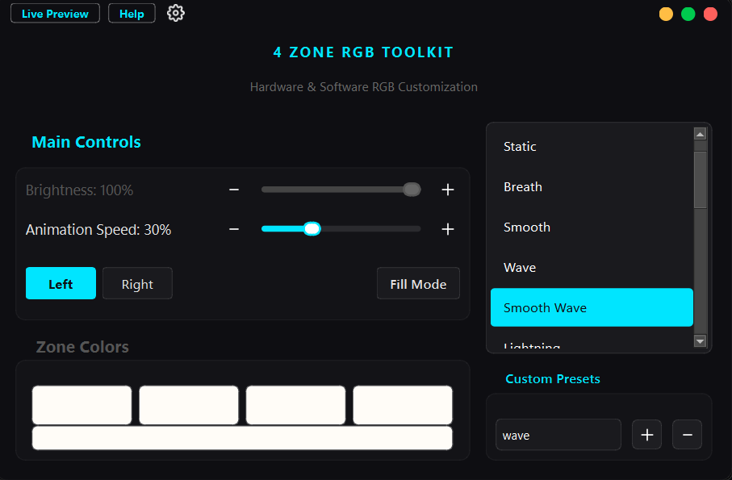

  
  <h1>4 Zone RGB Toolkit</h1>

A modern, highly optimized hardware and software RGB visualization tool specifically designed and tested for Lenovo LOQ and Legion laptops with 4-Zone RGB keyboards. This toolkit provides a sleek, Fluent Design-inspired graphical interface that lets you customize keyboard lighting dynamically.

Current Version: v2.81

## Features

### Hardware Modes

- Off
- Static
- Breath
- Smooth
- Wave

### Software Modes

- Smooth Wave
- Lightning
- Party
- Realistic Fire
- Scanner (Cylon)
- Aurora Borealis
- Meteor Shower
- Ambient Screen Color
- Battery Visualizer
- Mouse-Reactive Aura
- Pomodoro Timer
- Live Audio Visualizer
- Temperature Mode (Beta)

## Hardware Compatibility

**Officially Tested & Supported:**
- Lenovo Legion Series (2020-2024 models)
- Lenovo LOQ Series (2023-2024 models)
- Must have a 4-Zone RGB keyboard.

> Note: Using this software on unsupported hardware, such as per-key RGB keyboards or non-Lenovo devices, may result in unexpected behavior, failure to locate the controller, or crashes.

## Installation

Download the latest version from [Releases](https://github.com/AFcoder10/4-Zone-Keyboard-RGB-Toolkit/releases).

---
Give a star if you like the app!

---
Inspired by [L5P-Keyboard-RGB](https://github.com/4JX/L5P-Keyboard-RGB) by 4JX.
