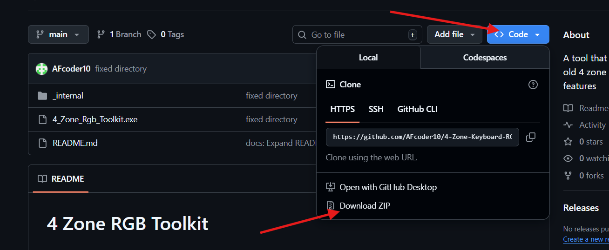

#  4 Zone RGB Toolkit

A modern, highly optimized hardware and software RGB visualization tool specifically designed and tested for Lenovo LOQ and Legion laptops with 4-Zone RGB keyboards. This toolkit provides a sleek, Fluent Design-inspired graphical interface that allows users to fully customize their keyboard lighting configurations dynamically.

## Features

- **Hardware Modes:** Directly control the keyboard's built-in firmware effects including Static, Breath, Smooth, Wave (Left), and Wave (Right).
- **Advanced Software Engine:** Unlocks custom software-driven effects rendered in real-time, including:
  - **Smooth Wave (Left / Right):** A butter-smooth sweeping gradient across the keyboard zones. Includes an optional "Fill Mode" toggle to wipe the keyboard one solid color at a time cleanly.
  - **Lightning:** An atmospheric mode mimicking realistic lightning strikes crashing across the zones dynamically. Includes adjustable frequency and ambient night-sky glows.
  - **Party:** A wildly fast, high-tempo mode pumping vibrant and completely randomized extreme colors aggressively across the zones! Fully reactive to the speed slider.
  - **Ambient Screen Color:** Real-time screen capture technology that dynamically mirrors the dominant colors of your display directly onto the keyboard.
  - **[Beta] Live Audio Visualizer:** Real-time volume meter using live WASAPI Loopback, translating your overall desktop audio loudness into a sweeping horizontal volume indicator.
- **Custom Presets:** Mix and match modes, speeds, brightness levels, and distinct zone colors, and then save them as named profiles. Switch between limitless configurations with a dropdown.
- **Micro-Adjustment Controls:** Adjust animation speeds and LED brightness precisely down to 5% increments without dragging the slider.
- **Seamless Startup Priority:** Choose exactly what preset profile the software will force-load on boot, seamlessly jumping back into your favorite setup automatically.
- **Tray & System Integration:** Can run silently in the system tray or cleanly inject itself into the Windows Startup registry sequence.
- **Safety First:** Gracefully blacks out the keyboard LEDs automatically whenever the software is completely shut down.

## Hardware Compatibility

**Officially Tested & Supported:**
- Lenovo Legion Series (2020-2024 models)
- Lenovo LOQ Series
- *Must have a 4-Zone RGB Keyboard.*

> **⚠️ Note:** Using this software on unsupported hardware (e.g., Per-Key RGB keyboards, or non-Lenovo devices) may result in unexpected behavior, failure to locate the controller, or crashes.

## Installation

1. 
2. Unzip the downloaded file.
3. Open the `.exe` file to run the application.

*Note: Do not move or extract only the `.exe` file. You need to keep all the surrounding files and folders in the directory to run it properly.*

## Troubleshooting

- **Keyboard Not Found:** Ensure your specific PID is mapped successfully in `python_controller.py`. If you have a different Lenovo model, you may need to add its Product ID hex definition under `L5PKeyboard.PRODUCT_IDS`.
- **Audio Visualizer Not Reactive:** Ensure your system is outputting desktop audio (WASAPI Loopback captures the default speaker stream). If using specialized headsets, virtual cables, or specific soundboards, the loopback might fail to bind to the active mixer.

---
*Built with ❤️ utilizing Python, PySide6, and the Windows Desktop Duplication API.*
